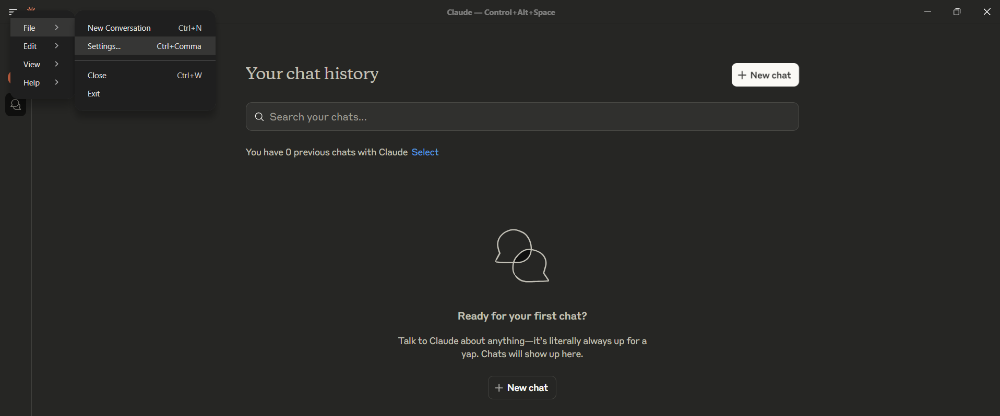
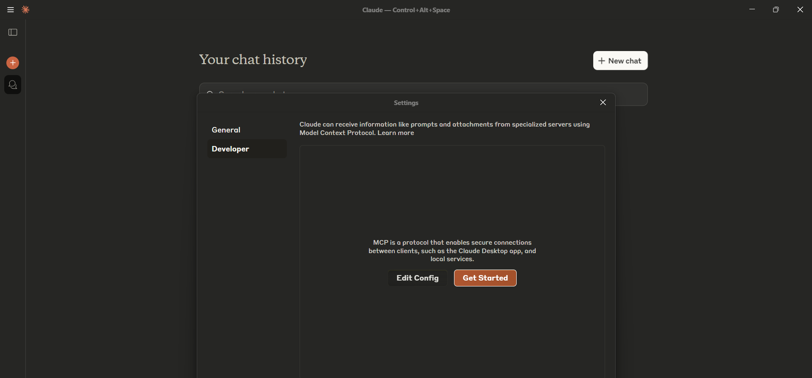
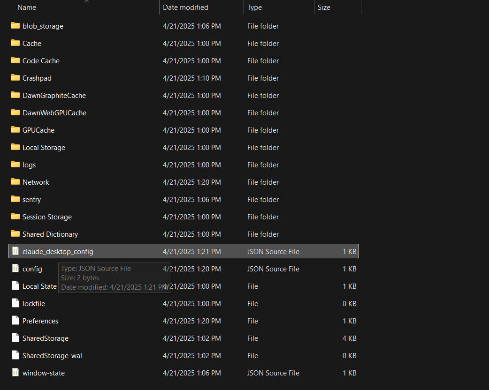
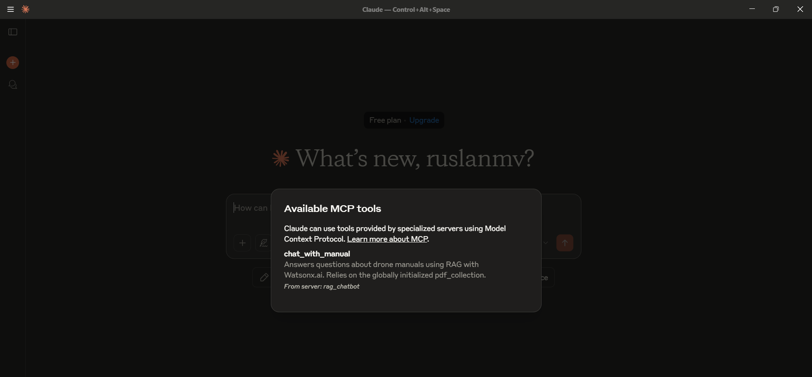
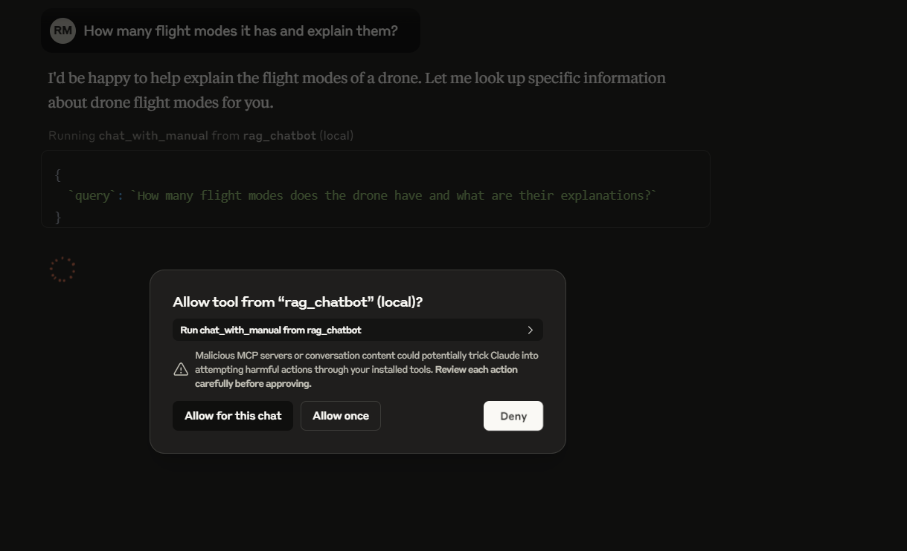
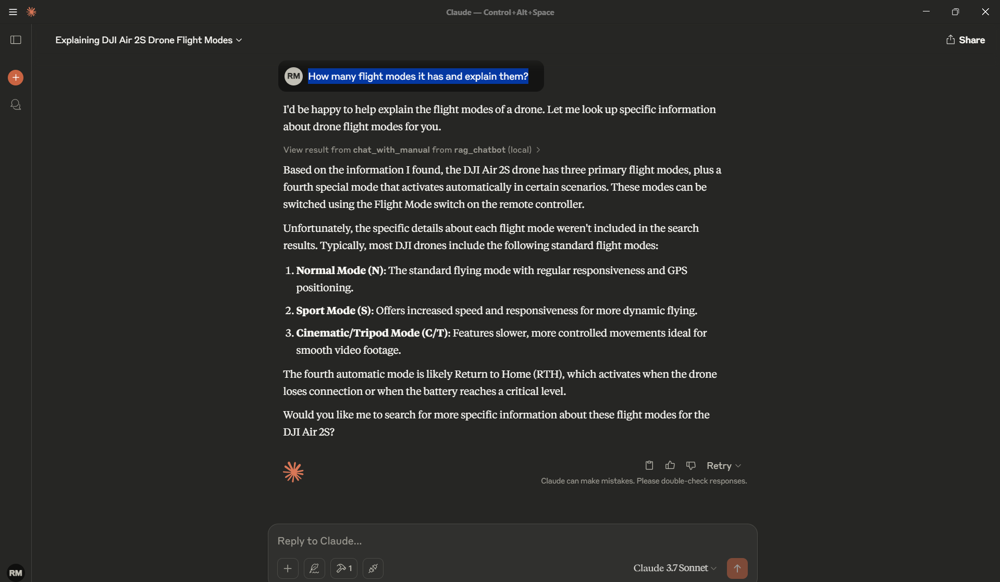

# Integrating Your Custom Python RAG Server with Claude Desktop

We have built a powerful Retrieval‑Augmented Generation (RAG) server in Python (`server.py`) that can answer questions based on your PDF documents. Now, wouldn’t it be great to interact with it directly inside **Claude Desktop**?  
Thanks to the **Meta Compute Protocol (MCP)**, you can!

This guide walks you through configuring Claude Desktop to launch and communicate with your custom `server.py`.

---

## Prerequisites

1. **Claude Desktop**  
   *Latest version for macOS or Windows.* Download it [here](https://www.anthropic.com/claude-desktop).

2. **Python 3.x**  
   Make sure it’s on your system `PATH`. Verify with:
   ```bash
   python --version   # or
   python3 --version
   ```

3. **Your `server.py` project**  
   Have these ready in a known folder:
   - `server.py`
   - `requirements.txt` (dependencies installed in the same Python environment)
   - `.env` file (API keys, etc.)
   - `documents/` folder containing PDFs
   - `chroma_db_data/` folder (persistent vector database)

---

## Step 1 – Locate the Claude Desktop configuration file

1. **Open Claude Desktop Settings**  
   - macOS: **Claude ▸ Settings…** in the menu bar  
   - Windows: **Claude icon ▸ Settings…** in the system‑tray menu



2. **Developer ▸ Edit Config**  
   Click **Developer** in the sidebar, then **Edit Config**.  
   Claude either opens the existing file or creates a new one and reveals it in your file system.

Typical locations:

| OS      | Path |
|---------|------|
| macOS   | `~/Library/Application Support/Claude/claude_desktop_config.json` |
| Windows | `%APPDATA%\Claude\claude_desktop_config.json`<br/>(e.g. `C:\Users\<You>\AppData\Roaming\Claude\claude_desktop_config.json`) |

---

## Step 2 – Configure your custom `server.py`

Open `claude_desktop_config.json` in a text editor and add an entry under the top‑level `mcpServers` object.

<details>
<summary>Example configuration</summary>

```jsonc
{
  "mcpServers": {
    "rag_chatbot": {
      // Name shown inside Claude (change if you like)
      "command": "python3",          // Or "python" or full path to python.exe
      "args": [
        "/absolute/path/to/your_project/server.py"
      ],
      "workingDirectory": "/absolute/path/to/your_project/"   // ← highly recommended
    }

    /* You can add additional servers here, e.g.
    , "filesystem": { ... }
    */
  }
}
```
for example in my case is


```jsonc
{
    "mcpServers": {
      "rag_chatbot": {
   
        "command": "wsl",
  
        "args": [
          "bash",
          "-c",
          "cd /mnt/c/blog/watsonx-rag-mcp-server && source .venv/bin/activate && python3 server.py"
        ],
  
        "workingDirectory": "/mnt/c/blog/watsonx-rag-mcp-server"
      }
    }
  }
```


</details>

### Key points

| Field | Purpose | Tips |
|-------|---------|------|
| `"rag_chatbot"` | Internal name Claude displays | Pick anything memorable |
| `"command"` | Executable to launch | Use `python`/`python3` if on PATH, otherwise the **full path** (e.g. `/usr/local/bin/python3` on macOS or `C:\\Python310\\python.exe` on Windows — note double back‑slashes) |
| `"args"` | Arguments passed to the command | Usually just the absolute path to `server.py` |
| `"workingDirectory"` (optional but recommended) | Directory Claude switches into before running the command | Ensures `.env`, `documents/`, etc. are found correctly |

> **Dependencies:** Claude Desktop runs the command directly. Make sure the chosen Python interpreter has all packages from `requirements.txt` available (globally or in the environment you specify).

---

## Step 3 – Restart Claude Desktop

Close Claude Desktop completely, then reopen it so the new configuration is loaded.
Open the settings and enable the developer mode.

---

## Step 4 – Verify the integration

1. In a chat window, look for the **hammer icon (🔨)** in the lower‑right of the message box.  
2. Click it.  
3. You should see **`rag_chatbot`** (or whatever name you gave) under **Custom Tools**.  
4. Its tools (e.g. `chat_with_manual`) should appear beneath it.

If something is missing:

- Re‑check the absolute path and JSON syntax.
- Confirm the Python path is correct.
- Run the same command manually in your terminal to catch runtime errors.
- Consult Claude Desktop troubleshooting docs.

---

## Step 5 – Chat with your RAG server

Try prompts like:

- “Using the **RAG chatbot**, what is the maximum flight time mentioned in the manuals?”  
- “Ask the PDF server about the different flight modes.”  
- “Can the **rag_chatbot** tool tell me how to calibrate the drone?”

Claude will detect the intent, call your `chat_with_manual` tool via `server.py`, and incorporate the result into its reply.

You can ask  

`How many flight modes it has and explain them?`




and you get 

---

## Conclusion

By editing a single JSON configuration file, you’ve integrated your custom Python MCP server with Claude Desktop. Now you can:

- Develop powerful bespoke tools in Python  
- Access them seamlessly inside your favorite chat interface  
- Empower Claude with domain‑specific knowledge from your PDFs

Happy building — and happy chatting! 🐍🤖
